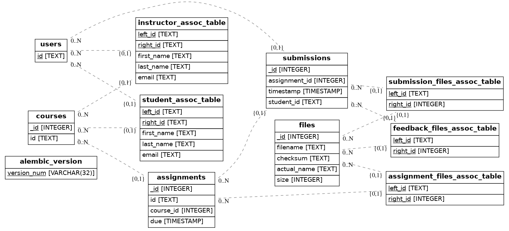

# Data base structure for ngshare
ngshare is using [SQLAlchemy](https://www.sqlalchemy.org/) to model data
 relationships and manage database queries.

## Tables
* `User`: analogous to users of JupyterHub. A user can be student, instructor,
 or both.
* `Course`: a course for nbgrader, can have multiple students and instructors.
* `Assignment`: an assignment, have multiple states; belong to a course.
* `Submission`: a student's submission to an assignment; includes submission
 and feedback; belong to an assignment.
* `File`: Store files related to 1) assignment, 2) submission, or 3) feedback.

### Allocation tables
Allocation tables are created by SQLAlchemy to represent many to many relation.
These should not be worried about when designing high-level database structure.
* `instructor_assoc_table`: Relationship between instructor (User) and Course
* `student_assoc_table`: Relationship between student (User) and Course
* `assignment_files_assoc_table`: Relationship between Assignment and File
* `submission_files_assoc_table`: Relationship between Submission and File
* `feedback_files_assoc_table`: Relationship between feedback (Submission) and
 File

## Assignment state
(TODO)

## Generate a graph using [eralchemy](https://pypi.org/project/ERAlchemy/)
```
pip3 install eralchemy
eralchemy -i sqlite:////tmp/vserver.db -o er.png
```

### Entity Relation diagram (manually maintained)


